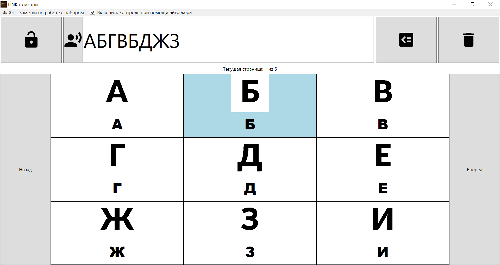
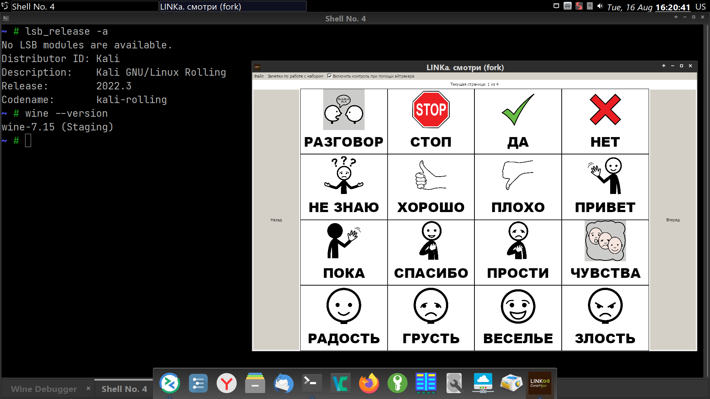

# LINKa.look-fork

Это репозиторий форка программы "LINKa. Смотри".

Домашняя страница оригинального проекта – <https://linka.su/looks/>, репозиторий с исходными текстами – <https://github.com/linkasu/LINKa.look-windows>. Новая версия "LINKa. Смотри", переписанная Бакаидовым на TypeScript — <https://github.com/linkasu/linka.looks-electron>, установочный файл — <https://github.com/linkasu/linka.looks-electron/releases>.

Язык – C#, написана с использованием WPF, версия .NET Framework – 4.8.

Форк поддерживает Паша Любецкий <pasha.liubetski@yandex.com>, лицензия программы – MIT License, как и у исходного проекта, лицензия набора карточек – Creative Commons Attribution 4.0 International (CC-BY 4.0).

## Что делать, если программа не запускается

Скорее всего, нужно установить [Visual C++ Redistributables / Распространяемые компоненты Visual C++](https://learn.microsoft.com/ru-ru/cpp/windows/latest-supported-vc-redist?view=msvc-170) и [драйверы для айтрекеров Tobii](https://gaming.tobii.com/getstarted/#tobii). Также проверьте, чтобы был установлен [.NET Framework 4.8.1](https://dotnet.microsoft.com/en-us/download/dotnet-framework/thank-you/net481-rus).

## Зачем это и что изменилось

Это не совсем конечный продукт, рассчитанный на массового потребителя. Я ставил перед собой несколько задач:

1. Адаптация под нужды пользователей.

    У пользователей возникали жалобы на исходную программу: мелкий шрифт подписей к карточкам, мало самих наборов карточек, баги в программе.

2. Простимулировать развитие исходного проекта, который развивается медленно.

    Я удалил некритичные для работы функции, которые содержали много багов, например, редактор карточек. Я не спорю, что интерактивный графический редактор наборов карточек – очень важная функция, но разобраться в незнакомом коде и исправлять ошибки, приводящие к аварийной остановке программы, сложно. Так что я сосредоточился на том, чтобы "отловить" баги в основной функциональности проекта.

    Наборы карточек хранятся тут: <https://github.com/pasha-liubetski/linka_boards>.

    Для создания карточек, похожих на ["LINKa: Бумажная клавиатура"](https://linka.su/linka-paperboard/), я использую самописный ruby-скрипт: <https://github.com/pasha-liubetski/linka_gen_kbd>. Идея этого набора карточек – большая экранная клавиатура для детей, которым сложно фиксировать глаза в одной точке из-за нистагма.

    Обычные наборы карточек я генерирую с помощью <https://github.com/pasha-liubetski/linka_gen> (это тоже самописный скрипт на языке ruby).

    Довольно странно, я понимаю, что программа LINKa.Smotri – это приложение для Windows, а мои скрипты для генерации карточек работают на Linux (в среде Windows нужно установить WSL/WSL2). Но писать эти скрипты именно на ruby было достаточно удобно и быстро, и моей задачей было, скорее, сделать как можно быстрее готовый продукт, и вместе с этим продемонстрировать новые идеи для проектов. Так что во многом этот форк – прототип, демонстрация идей, которые можно вернуть в исходный проект.

    Аварийных остановок программы стало меньше. Историю борьбы с некоторыми "багами" можно проследить в истории коммитов. В любом случае, я надеюсь, что появление форка поможет исходному проекту развиваться активнее.

## Запуск в GNU/Linux

У меня получилось запустить LINKa в wine-staging 7.15 на Kali GNU/Linux 2022.3 (это почти Debian Testing). Для запуска потребовалось установить .NET Framework 4.8 через winetricks. В принципе, шаги для запуска в wine те же, что и для других WPF-приложений.

[Getting Windows WPF Applications to run with Wine (Reddit)](https://www.reddit.com/r/linux4noobs/comments/firqs9/getting_windows_wpf_applications_to_run_with_wine/)
