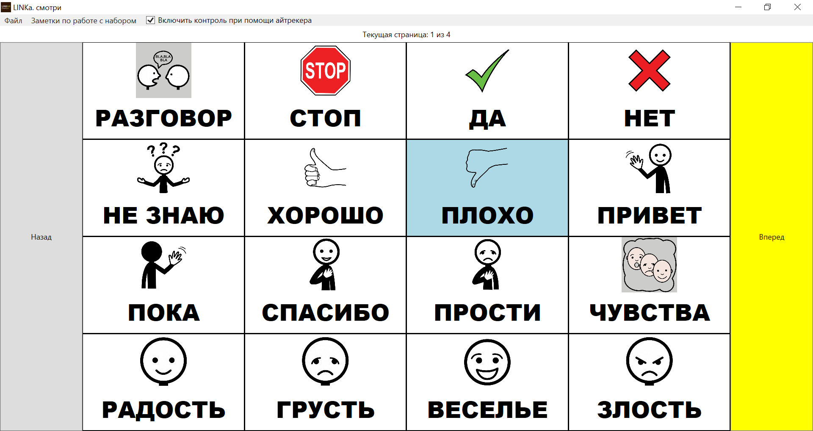

# LINKa.look-fork

Это репозиторий форка программы "LINKa. Смотри".

Домашняя страница оригинального проекта - <https://linka.su/looks/>, репозиторий с исходными текстами - <https://github.com/linkasu/LINKa.look-windows>.

Язык - C#, написана с использованием WPF, версия .NET Framework - 4.8.
Форк поддерживает Паша Любецкий <mailto:pasha.liubetski@yandex.com>, лицензия - MIT License, как и у исходного проекта.

## Запуск в GNU/Linux

У меня получилось запустить LINKa в wine-staging 7.15 на Kali GNU/Linux 2022.3 (это почти Debian Testing). Для запуска потребовалось установить .NET Framework 4.8 через winetricks. В принципе, шаги для запуска в wine те же, что и для других WPF-приложений.

[Getting Windows WPF Applications to run with Wine (Reddit)](https://www.reddit.com/r/linux4noobs/comments/firqs9/getting_windows_wpf_applications_to_run_with_wine/)
